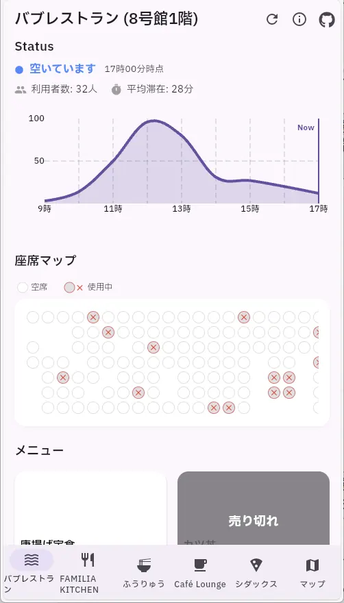
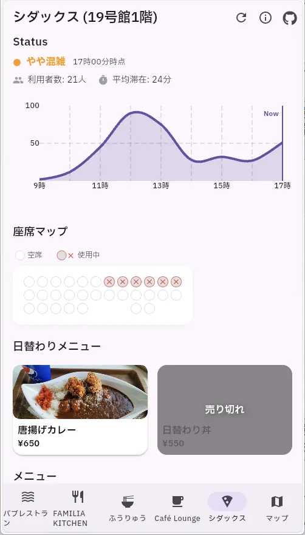
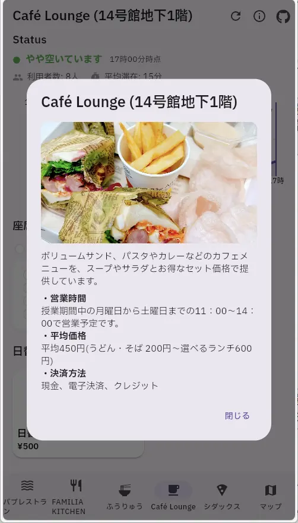
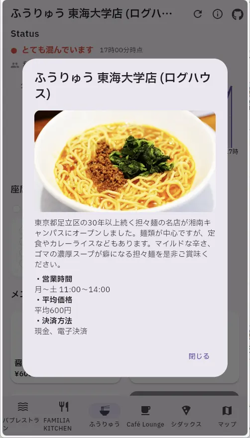

# flutter_cafeteria_app

### View the demo online [click](https://flutter-cafeteria-app-web.netlify.app/)

### Function list
- [x] Real-time display of available seats and congestion status for each cafeteria
- [x] Menu stock information available
- [x] Congestion levels visualized with color coding ("Low", "Medium", "High")
- [ ] Notification feature (congestion alerts, coupon distribution, etc.)
- [ ] Widget display to check status from the home screen without opening the app
- [ ] Point system and rating feature to encourage usage

